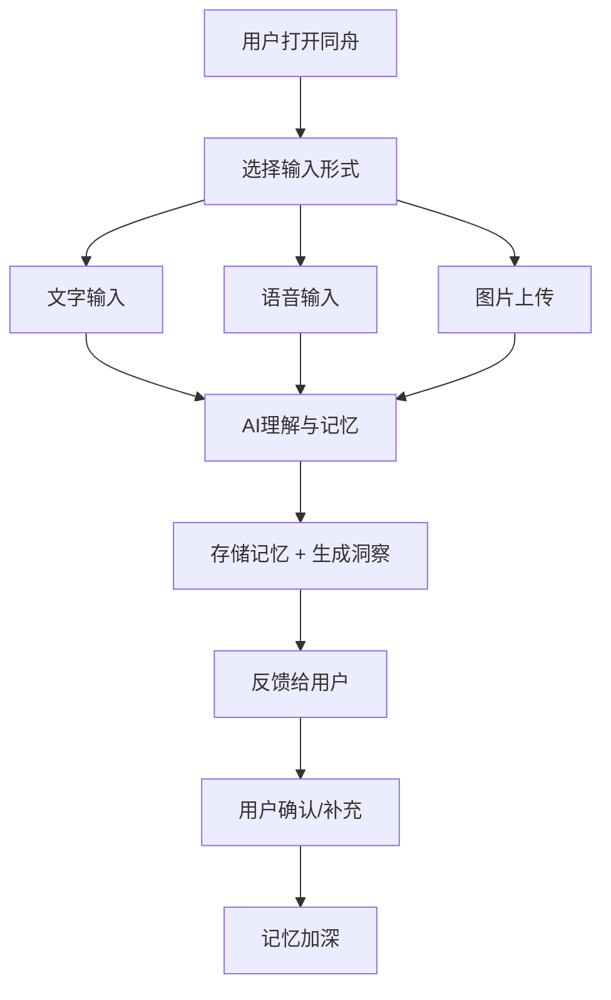

# 终生陪伴系统 - 产品需求文档

## 1. 产品概述

**"同舟" - 你的终生思维伴侣**

一个以"分享"为核心的生命周期伴侣系统。系统具有记忆、成长、反馈三大能力，能理解用户抛入的任何形式数据——文字、语音、图片、情绪、想法——陪伴用户度过每一个思考时刻，见证用户的成长与蜕变。

### 产品定位
- **情感层**: 温暖的陪伴者，而非冰冷的工具
- **认知层**: 记忆的延伸，成为"第二大脑"
- **成长层**: 通过持续交互，理解用户、进化自身

## 2. 核心功能

### 2.1 三大核心能力

| 能力 | 描述 | 用户价值 |
|------|------|----------|
| **记忆** | 记住用户分享的一切，包括背景、情感、关联关系 | 不再遗忘重要的人和事 |
| **成长** | 基于记忆持续进化理解力，更懂用户 | 越用越贴心，越用越懂你 |
| **反馈** | 基于记忆主动提供洞察、提醒、关联思考 | 在恰当的时机给恰当的反馈 |

### 2.2 数据接纳能力

系统设计为"无限制输入"，用户可以随时随地抛入任何形式的数据：

- **文本**: 灵感、想法、碎碎念
- **图片**: 截图、照片、灵感图
- **语音**: 语音笔记、口述日记
- **情绪**: 心情标签、情绪日记
- **任务**: 待办事项、计划目标
- **链接**: 文章、网页、有趣发现
- **文件**: 文档、PDF等附件

### 2.3 核心页面结构

#### 主交互页面 - "同舟空间"
- **即时输入区**: 全能的输入入口，支持文字/图片/语音
- **记忆流**: 时间线形式展示所有分享内容
- **智能分类**: 自动将内容归类为想法/记忆/任务/灵感等
- **关联洞察**: 展示相关内容、过往记忆

#### 记忆中心
- **人物记忆**: 记住你说过的每个人、每段关系
- **事件脉络**: 重要事件的完整时间线
- **知识图谱**: 概念、想法、知识的关联网络

#### 成长档案
- **自我报告**: 基于记忆生成的阶段性总结
- **情绪曲线**: 可视化的情绪变化历程
- **成长里程碑**: 重要时刻的记录与回顾

#### 智能反馈面板
- **今日回顾**: 基于历史的智能提醒
- **关联推送**: 主动展示相关记忆
- **成长洞察**: 告诉你一些你自己可能没注意到的变化

## 3. 核心交互流程

### 3.1 分享流程


### 3.2 反馈触发机制
- **即时反馈**: 用户输入后立即给出理解和回应
- **定时回顾**: 基于历史数据定时推送相关记忆
- **主动洞察**: 基于行为模式分析后主动提供建议

## 4. 用户界面设计

### 4.1 设计理念
**温暖·智慧·陪伴**
- 主色调选择温暖的琥珀色系，如同烛光的温度
- 大量使用圆角和柔和阴影，传递安全感
- 深色主题为主，保护隐私，专注内容

### 4.2 色彩系统
```css
:root {
  --primary: #D4A574;        /* 温暖琥珀 */
  --secondary: #8B7355;      /* 沉稳棕 */
  --accent: #7B9E89;         /* 生命绿 - 代表成长 */
  --background: #1A1A1D;     /* 深邃黑 */
  --surface: #242428;         /* 卡片背景 */
  --text-primary: #F5F5F5;    /* 主文字 */
  --text-secondary: #A0A0A0; /* 次要文字 */
  --success: #6BBF8A;        /* 正面情绪 */
  --warning: #E8B86D;         /* 中性情绪 */
  --danger: #D4726A;          /* 负面情绪 */
}
```

### 4.3 字体选择
- **标题**: Noto Serif SC - 有书卷气的中文衬线体
- **正文**: Noto Sans SC - 清晰易读的现代无衬线体
- **数字/时间**: JetBrains Mono - 现代等宽字体

### 4.4 动效设计
- **页面切换**: 柔和的淡入淡出，如呼吸般自然
- **内容加载**: 从模糊到清晰的渐显效果
- **交互反馈**: 微妙的弹性动画，传递"被接住"的感觉
- **状态变化**: 平滑的颜色过渡，避免突兀

### 4.5 页面布局
| 页面 | 核心布局 | 特色元素 |
|------|----------|----------|
| 同舟空间 | 左输入区 + 右记忆流 | 悬浮的AI对话气泡 |
| 记忆中心 | 卡片网格 + 时间轴 | 人物头像节点 |
| 成长档案 | 仪表盘 + 日历视图 | 渐变色的进度环 |
| 反馈面板 | 通知卡片流 | 分类标签 + 优先级 |

### 4.6 响应式策略
- **桌面端**: 三栏布局，充分展示记忆网络
- **平板端**: 双栏布局，核心功能优先
- **移动端**: 单栏+底部导航，专注于输入和浏览

## 5. 技术实现方向

### 5.1 前端技术栈
- React 18 + TypeScript
- Tailwind CSS + 自定义CSS变量
- Zustand 状态管理
- React Router 路由
- Lucide React 图标库

### 5.2 数据存储策略
- 浏览器本地存储 (localStorage/IndexedDB)
- 模拟AI理解引擎（基于规则和模板）
- 模拟记忆关联网络

### 5.3 核心组件
1. **UniversalInput**: 万能输入组件
2. **MemoryStream**: 记忆流展示组件
3. **InsightCard**: 洞察反馈卡片
4. **GrowthChart**: 成长数据可视化
5. **PersonMemory**: 人物记忆卡片
6. **EmotionTag**: 情绪标签组件

## 6. 成功标准

### 6.1 用户体验指标
- 用户愿意每天打开并分享内容
- 用户感受到系统"记住了自己"
- 反馈内容让用户感到"被理解"

### 6.2 产品特性指标
- 完美支持所有类型的数据输入
- 记忆关联准确且有意义
- 反馈时机恰当、内容有价值
