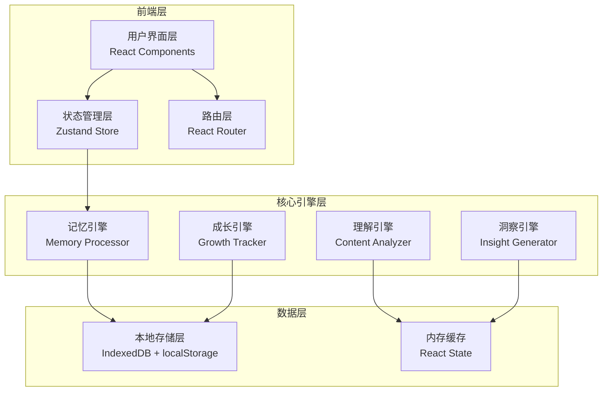
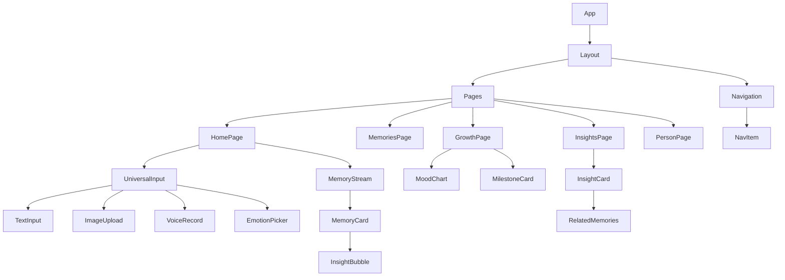

# 终生陪伴系统 - 技术架构文档

## 1. 系统架构设计

### 1.1 整体架构



### 1.2 架构分层说明

| 层级 | 职责 | 技术实现 |
|------|------|----------|
| **用户界面层** | 渲染界面、收集用户输入、展示反馈 | React + Tailwind CSS |
| **状态管理层** | 管理全局状态、组件间通信 | Zustand |
| **路由层** | 页面导航、单页应用路由 | React Router v6 |
| **记忆引擎** | 存储、检索、关联记忆数据 | IndexedDB + 关联算法 |
| **理解引擎** | 解析输入内容、提取实体、识别情绪 | 规则引擎 + 模板匹配 |
| **洞察引擎** | 生成智能反馈、关联建议 | 模式识别 + 统计推断 |
| **成长引擎** | 跟踪用户成长轨迹、生成报告 | 时间序列分析 |

## 2. 技术选型

### 2.1 前端技术栈

| 技术 | 版本 | 用途 |
|------|------|------|
| React | 18.x | UI框架 |
| TypeScript | 5.x | 类型安全 |
| Vite | 5.x | 构建工具 |
| Tailwind CSS | 3.x | 样式框架 |
| Zustand | 4.x | 状态管理 |
| React Router | 6.x | 路由管理 |
| Lucide React | latest | 图标库 |
| date-fns | latest | 日期处理 |

### 2.2 数据存储方案

| 存储方式 | 用途 | 数据类型 |
|----------|------|----------|
| localStorage | 轻量配置、偏好设置 | JSON |
| IndexedDB | 大量记忆数据、媒体缓存 | 二进制/JSON |
| 内存状态 | 当前会话数据、缓存 | React State |

## 3. 路由定义

| 路由路径 | 页面名称 | 功能描述 |
|----------|----------|----------|
| `/` | 同舟空间 | 主交互页面，即时输入+记忆流 |
| `/memories` | 记忆中心 | 所有记忆的分类浏览 |
| `/person/:id` | 人物详情 | 特定人物的完整记忆 |
| `/growth` | 成长档案 | 成长数据可视化 |
| `/insights` | 洞察反馈 | 智能反馈面板 |

## 4. 数据模型设计

### 4.1 核心实体关系

```mermaid
erDiagram
    Memory ||--o{ Tag : "has"
    Memory ||--o{ Insight : "generates"
    Memory }o--|| Person : "mentions"
    Person ||--o{ Memory : "appears in"
    Insight }o--|| GrowthRecord : "contributes to"
    
    Memory {
        string id PK
        string content
        string type "text|image|voice|emotion|task|link"
        timestamp createdAt
        timestamp updatedAt
        object metadata
        array relatedIds
    }
    
    Person {
        string id PK
        string name
        string description
        array appearances
        timestamp firstSeen
        timestamp lastSeen
    }
    
    Tag {
        string id PK
        string name
        string category "idea|thought|memory|task|inspiration"
        number count
    }
    
    Insight {
        string id PK
        string content
        string type "association|summary|reminder|pattern"
        string relatedMemoryIds
        timestamp generatedAt
        boolean viewed
    }
    
    GrowthRecord {
        string id PK
        date date
        number moodScore
        string summary
        array milestones
    }
}
```

### 4.2 TypeScript 类型定义

```typescript
// 记忆类型
type MemoryType = 'text' | 'image' | 'voice' | 'emotion' | 'task' | 'link';

// 记忆实体
interface Memory {
  id: string;
  content: string;
  type: MemoryType;
  createdAt: Date;
  updatedAt: Date;
  metadata: {
    tags?: string[];
    persons?: string[];
    mood?: number;
    source?: string;
  };
  relatedIds: string[];
}

// 人物实体
interface Person {
  id: string;
  name: string;
  description: string;
  memoryIds: string[];
  firstSeen: Date;
  lastSeen: Date;
}

// 洞察实体
interface Insight {
  id: string;
  content: string;
  type: 'association' | 'summary' | 'reminder' | 'pattern';
  relatedMemoryIds: string[];
  generatedAt: Date;
  viewed: boolean;
}

// 成长记录
interface GrowthRecord {
  id: string;
  date: Date;
  moodScore: number;
  summary: string;
  milestones: string[];
}

// 标签实体
interface Tag {
  id: string;
  name: string;
  category: 'idea' | 'thought' | 'memory' | 'task' | 'inspiration';
  count: number;
}
```

## 5. 核心组件架构

### 5.1 组件层级



### 5.2 组件清单

| 组件名称 | 职责 | 文件路径 |
|----------|------|----------|
| `Layout` | 全局布局容器 | `src/components/Layout.tsx` |
| `Navigation` | 导航栏组件 | `src/components/Navigation.tsx` |
| `UniversalInput` | 万能输入组件 | `src/components/UniversalInput.tsx` |
| `MemoryStream` | 记忆流展示 | `src/components/MemoryStream.tsx` |
| `MemoryCard` | 单条记忆卡片 | `src/components/MemoryCard.tsx` |
| `InsightBubble` | AI洞察气泡 | `src/components/InsightBubble.tsx` |
| `EmotionPicker` | 情绪选择器 | `src/components/EmotionPicker.tsx` |
| `TagFilter` | 标签过滤器 | `src/components/TagFilter.tsx` |
| `MoodChart` | 情绪曲线图 | `src/components/MoodChart.tsx` |
| `InsightCard` | 洞察卡片 | `src/components/InsightCard.tsx` |
| `PersonCard` | 人物记忆卡片 | `src/components/PersonCard.tsx` |
| `Timeline` | 时间轴组件 | `src/components/Timeline.tsx` |

## 6. 状态管理设计

### 6.1 Zustand Store 结构

```typescript
// 主 Store - src/store/useStore.ts
interface AppState {
  // 记忆数据
  memories: Memory[];
  addMemory: (memory: Memory) => void;
  updateMemory: (id: string, updates: Partial<Memory>) => void;
  
  // 人物数据
  persons: Person[];
  addPerson: (person: Person) => void;
  
  // 洞察数据
  insights: Insight[];
  addInsight: (insight: Insight) => void;
  markInsightViewed: (id: string) => void;
  
  // 成长数据
  growthRecords: GrowthRecord[];
  addGrowthRecord: (record: GrowthRecord) => void;
  
  // UI状态
  currentView: 'home' | 'memories' | 'growth' | 'insights';
  setCurrentView: (view: AppState['currentView']) => void;
  
  // 过滤器状态
  activeTags: string[];
  toggleTag: (tagId: string) => void;
  
  // 时间范围
  timeRange: { start: Date; end: Date };
  setTimeRange: (range: AppState['timeRange']) => void;
}
```

## 7. 存储服务设计

### 7.1 存储服务接口

```typescript
// src/services/storage.ts
interface StorageService {
  // 记忆操作
  saveMemory(memory: Memory): Promise<void>;
  getMemories(): Promise<Memory[]>;
  getMemoryById(id: string): Promise<Memory | null>;
  deleteMemory(id: string): Promise<void>;
  
  // 人物操作
  savePerson(person: Person): Promise<void>;
  getPersons(): Promise<Person[]>;
  
  // 洞察操作
  saveInsight(insight: Insight): Promise<void>;
  getInsights(): Promise<Insight[]>;
  
  // 成长记录
  saveGrowthRecord(record: GrowthRecord): Promise<void>;
  getGrowthRecords(): Promise<GrowthRecord[]>;
  
  // 标签操作
  saveTag(tag: Tag): Promise<void>;
  getTags(): Promise<Tag[]>;
  
  // 统计操作
  getStats(): Promise<StorageStats>;
}

interface StorageStats {
  totalMemories: number;
  totalPersons: number;
  totalInsights: number;
  streakDays: number;
  mostUsedTags: Tag[];
}
```

## 8. 核心引擎设计

### 8.1 记忆引擎

```typescript
// src/engine/MemoryEngine.ts
class MemoryEngine {
  // 存储记忆
  store(memory: Memory): Promise<void>;
  
  // 检索相关记忆
  findRelated(memoryId: string): Memory[];
  
  // 按时间范围检索
  findByTimeRange(start: Date, end: Date): Memory[];
  
  // 按标签检索
  findByTag(tagId: string): Memory[];
  
  // 提及的人物
  extractPersons(content: string): string[];
  
  // 提取标签
  extractTags(content: string): string[];
}
```

### 8.2 理解引擎

```typescript
// src/engine/UnderstandingEngine.ts
class UnderstandingEngine {
  // 解析输入内容
  parse(input: UserInput): ParsedContent;
  
  // 识别情绪
  detectEmotion(content: string): number; // -1 to 1
  
  // 识别意图
  detectIntent(content: string): 'share' | 'query' | 'reflect' | 'task';
  
  // 提取实体
  extractEntities(content: string): Entity[];
  
  // 生成摘要
  summarize(content: string): string;
}
```

### 8.3 洞察引擎

```typescript
// src/engine/InsightEngine.ts
class InsightEngine {
  // 生成关联洞察
  generateAssociations(memory: Memory): Insight[];
  
  // 生成周期性总结
  generatePeriodicSummary(period: 'day' | 'week' | 'month'): Insight;
  
  // 生成提醒
  generateReminders(): Insight[];
  
  // 识别成长模式
  detectGrowthPatterns(): Pattern[];
}
```

## 9. 项目文件结构

```
/workspace
├── index.html
├── package.json
├── vite.config.ts
├── tailwind.config.js
├── tsconfig.json
├── .trae
│   └── documents
│       ├── prd.md
│       └── tech-arch.md
├── public
│   └── favicon.ico
└── src
    ├── main.tsx
    ├── App.tsx
    ├── index.css
    ├── components
    │   ├── Layout.tsx
    │   ├── Navigation.tsx
    │   ├── UniversalInput.tsx
    │   ├── MemoryStream.tsx
    │   ├── MemoryCard.tsx
    │   ├── InsightBubble.tsx
    │   ├── EmotionPicker.tsx
    │   ├── TagFilter.tsx
    │   ├── MoodChart.tsx
    │   ├── InsightCard.tsx
    │   ├── PersonCard.tsx
    │   └── Timeline.tsx
    ├── pages
    │   ├── HomePage.tsx
    │   ├── MemoriesPage.tsx
    │   ├── GrowthPage.tsx
    │   ├── InsightsPage.tsx
    │   └── PersonPage.tsx
    ├── store
    │   └── useStore.ts
    ├── services
    │   └── storage.ts
    ├── engine
    │   ├── MemoryEngine.ts
    │   ├── UnderstandingEngine.ts
    │   └── InsightEngine.ts
    ├── types
    │   └── index.ts
    ├── utils
    │   ├── date.ts
    │   └── id.ts
    └── hooks
        └── useAutoSave.ts
```

## 10. 开发阶段规划

### 阶段一：基础框架 (1-2天)
- 项目初始化
- 路由配置
- 基础布局组件
- 状态管理初始化

### 阶段二：核心交互 (2-3天)
- 万能输入组件
- 记忆流展示
- 理解引擎实现
- 记忆存储服务

### 阶段三：进阶功能 (2-3天)
- 记忆中心页面
- 成长档案页面
- 洞察反馈页面
- 洞察引擎实现

### 阶段四：优化打磨 (1-2天)
- 动画效果增强
- 响应式适配
- 性能优化
- 数据迁移测试
